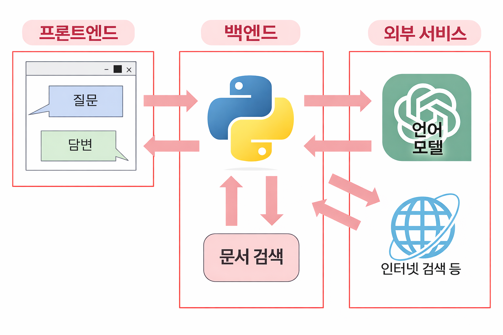

# LLM

## LLM 앱이란

1. 방대한 텍스트 데이터를 바탕으로 학습 실시
2. 그 지식을 바탕으로 자연 언어로 응답, 문장 생성, 번역, 요약 등을 실시하는 AI (GPT-4, gemini ...)

## LLM(Large Language Model)앱?

LLM을 활용한 앱은 이러한 언어 모델을 활용, 다양한 작업과 기능 제공

## LLM앱의 예

1. 챗봇

- 사용자의 텍스트에 대화 (고객지원, FAQ, 학습 보조 등)

2. 자신의 데이터를 바탕으로 답변 반환하는 채팅봇

- 인터넷에 없는 정보를 바탕으로 답변 반환 (사내 규칙, 영업 일보 등)

3. Excel작업 및 웹 정보 수집 자동화

- 일상적인 반복 업무의 자동화 실시 → 업무 효율화 공헌 (Excel작업 자동화, 웹 스크래핑...)

## LLM 앱 작동 방식

front-end, back-end, external service로 구성

### front-end

사용자가 직접 조작하는 UI

HTML, CSS, js

### back-end

1. front-end로부터 request받음
2. 언어 모델 호출(API) or 데이터 처리
3. response 반환

2번 단계에서 다양한 기능이 포함될 수 있음

- 역할: 언어 모델 call, data process, 문서 검색, 보안 및 인증 관리 등
- 기술: Node.js, Python 등을 주로 사용

front, back-end는 일반적으로 클라우드 배치/운영됨

본 강의는 클라우드 디플로이까지 설명 포함

### 외부 서비스

OpenAI가 제공하는 LLM은 'Web API'라는 인터페이스를 통해 이용

API (Application Programming Interface): 앱이 다른 앱과 서비스,데이터를 연결하기위한 연결수단

- 역할: back-end로부터 프롬프트를 받아 응답을 생성해 반환
    - back-end ー(프롬프트)→ API 
    - API ー(response/답변)→back-end

- 기술: python과 같은 프로그래밍 언어에서 웹 API호출해 사용

## LLM 앱 개발에 필요한 기술

- python
- HTML/CSS
- 인터넷 통신 및 웹 앱의 작동 방식
- 웹 앱을 만드는 방법
- OpenAI API 사용법
- 기타 기능 및 서비스와의 연동
- 클라우드 배포방법

